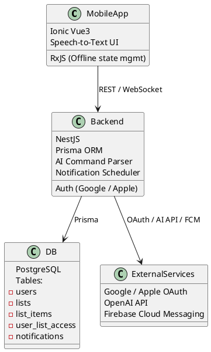
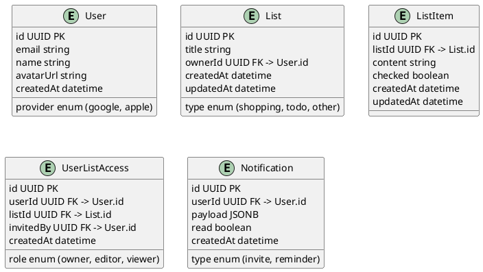

# SPEC-1-wiselist

## Background

Modern users need to quickly and conveniently create shopping lists, to-do lists, and reminders with the ability to share them. Such lists are often created spontaneously — during conversations, on the way home, or while planning the day. The **wiselist** project provides the ability to create, share, and edit lists in real-time by multiple users, including offline mode. Voice input and AI assistant integration make the process as natural as possible. Regular notifications help form a useful habit of maintaining lists.

## Requirements

### Must Have
- Registration and login via Google / Apple ID
- Creating lists with title and type (e.g., shopping, tasks)
- Collaborative editing of lists by multiple users
- Ability to share a list with another user
- Notifications when receiving a new list
- Offline functionality with synchronization when connected
- Voice input commands
- AI assistant for processing voice commands
- Storage of all entities in PostgreSQL via Prisma

### Should Have
- Motivational notifications every 2–3 days
- List change history
- User roles in lists (owner, editor, reader)
- Dark theme support

### Could Have
- Icons and tags for lists
- Custom list templates
- Calendar integration

### Won't Have (in MVP)
- Public lists
- Desktop version
- Advanced permission model

## Method

### Component Architecture



### Database Schema



### AI Command Processing

```plantuml
@startuml
actor User
User -> MobileApp : Voice command
MobileApp -> OpenAI STT : Speech recognition
OpenAI STT -> MobileApp : Command text
MobileApp -> Backend (NestJS) : Send text command
Backend -> OpenAI GPT : Command interpretation
OpenAI GPT -> Backend : Intent + entities
Backend -> DB : Update / retrieve data
Backend -> FCM : Send notifications (if needed)
Backend -> MobileApp : Response to user (updated list)
@enduml

```

## Implementation

### Phase 1: Authentication and Infrastructure
- NestJS backend + PostgreSQL via Prisma
- Google / Apple OAuth
- FCM push notifications
- Frontend initialization (Ionic Vue 3 + RxJS)

### Phase 2: Lists and Offline
- CRUD for lists and items
- Shared access and sharing
- Offline mode with synchronization
- WebSocket or polling updates

### Phase 3: Notifications
- Push notifications for invitations
- Cron for motivational reminders

### Phase 4: AI Assistant
- STT (Web Speech API or Whisper)
- OpenAI integration for NLP
- Support for intents: `add_items`, `share_list`, `show_list`, etc.

### Phase 5: Finalization
- UI polishing
- Offline mode indication
- Unit and e2e tests

## Milestones

| Month | Milestone | Content |
|-------|-----------|---------|
| 1     | 🔐 **Authentication + Infrastructure** | NestJS + PostgreSQL, OAuth, Prisma |
| 1–2   | 🗂 **Lists and Offline Mode** | CRUD, shared access, RxJS sync |
| 2     | 🔔 **Notifications** | FCM, push invites, motivation |
| 2–3   | 🧠 **AI Assistant (MVP)** | STT → OpenAI → intents |
| 3     | 🎨 **UX Polish + Tests** | UI, tests, indicators |
| 3–4   | 🚀 **MVP Pilot Release** | Beta testing and launch |

## Gathering Results

After release:
- Collection of user activity (via analytics like PostHog/Firebase)
- Engagement assessment (repeat sessions, accepted invitations)
- NPS surveys to identify needs
- Testing STT and NLP on real commands
