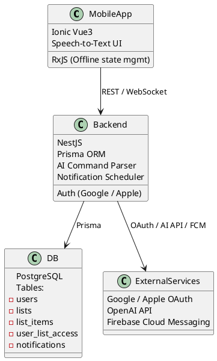

# SPEC-1-wiselist

## Background

Современным пользователям необходимо быстро и удобно формировать списки покупок, дел и напоминаний с возможностью совместного использования. Часто такие списки создаются спонтанно — во время разговора, по дороге домой или во время планирования дня. Проект **wiselist** предоставляет возможность создавать, делиться и редактировать списки в реальном времени несколькими пользователями, включая оффлайн-режим. Использование голосового ввода и интеграции с ИИ-ассистентом делает процесс максимально естественным. Регулярные нотификации помогают формировать полезную привычку вести списки.

## Requirements

### Must Have
- Регистрация и вход через Google / Apple ID
- Создание списков с наименованием и типом (например, покупки, задачи)
- Совместное редактирование списка несколькими пользователями
- Возможность делиться списком с другим пользователем
- Уведомления при получении нового списка
- Оффлайн-работа с синхронизацией при подключении
- Голосовой ввод команд
- ИИ-ассистент для обработки голосовых команд
- Хранение всех сущностей в PostgreSQL через Prisma

### Should Have
- Мотивационные уведомления каждые 2–3 дня
- История изменений списка
- Роли пользователей в списке (владелец, редактор, читатель)
- Поддержка тёмной темы

### Could Have
- Иконки и теги для списков
- Кастомные шаблоны списков
- Интеграция с календарём

### Won’t Have (в MVP)
- Публичные списки
- Настольная версия
- Продвинутая модель прав доступа

## Method

### Архитектура компонентов



### Схема базы данных

```plantuml
@startuml
entity User {
  id UUID PK
  email string
  name string
  avatarUrl string
  provider enum (google, apple)
  createdAt datetime
}

entity List {[WISELIST-implementation.md](../../Downloads/WISELIST-implementation.md)
  id UUID PK
  title string
  type enum (shopping, todo, other)
  ownerId UUID FK -> User.id
  createdAt datetime
  updatedAt datetime
}

entity ListItem {
  id UUID PK
  listId UUID FK -> List.id
  content string
  checked boolean
  createdAt datetime
  updatedAt datetime
}

entity UserListAccess {
  id UUID PK
  userId UUID FK -> User.id
  listId UUID FK -> List.id
  role enum (owner, editor, viewer)
  invitedBy UUID FK -> User.id
  createdAt datetime
}

entity Notification {
  id UUID PK
  userId UUID FK -> User.id
  type enum (invite, reminder)
  payload JSONB
  read boolean
  createdAt datetime
}
@enduml

```

### Обработка ИИ-команд

```plantuml
@startuml
actor User
User -> MobileApp : Голосовая команда
MobileApp -> OpenAI STT : Распознавание речи
OpenAI STT -> MobileApp : Текст команды
MobileApp -> Backend (NestJS) : Отправка текстовой команды
Backend -> OpenAI GPT : Интерпретация команды
OpenAI GPT -> Backend : Intent + entities
Backend -> DB : Обновление / получение данных
Backend -> FCM : Отправка уведомлений (если нужно)
Backend -> MobileApp : Ответ пользователю (обновлённый список)
@enduml

```

## Implementation

### Этап 1: Аутентификация и инфраструктура
- NestJS backend + PostgreSQL через Prisma
- Google / Apple OAuth
- FCM push-уведомления
- Инициализация фронта (Ionic Vue 3 + RxJS)

### Этап 2: Списки и оффлайн
- CRUD списков и элементов
- Совместный доступ и дележка
- Оффлайн режим с синхронизацией
- WebSocket или polling обновления

### Этап 3: Уведомления
- Пуши при приглашениях
- Cron для мотивационных напоминаний

### Этап 4: ИИ-ассистент
- STT (Web Speech API или Whisper)
- Интеграция с OpenAI для NLP
- Поддержка интентов: `add_items`, `share_list`, `show_list`, и т.д.

### Этап 5: Финализация
- UI-полировка
- Индикация оффлайн-режима
- Unit и e2e тесты

## Milestones

| Месяц | Веха | Содержание |
|-------|------|------------|
| 1     | 🔐 **Аутентификация + инфраструктура** | NestJS + PostgreSQL, OAuth, Prisma |
| 1–2   | 🗂 **Списки и оффлайн-режим** | CRUD, совместный доступ, RxJS sync |
| 2     | 🔔 **Уведомления** | FCM, push-инвайты, мотивация |
| 2–3   | 🧠 **ИИ-ассистент (MVP)** | STT → OpenAI → интенты |
| 3     | 🎨 **UX-полировка + тесты** | UI, тесты, индикации |
| 3–4   | 🚀 **Пилотный релиз MVP** | Бета-тест и запуск |

## Gathering Results

После релиза:
- Сбор пользовательской активности (через аналитики типа PostHog/Firebase)
- Оценка вовлечённости (повторные сессии, принятые приглашения)
- NPS-опросы для выявления потребностей
- Тестирование STT и NLP на реальных командах


